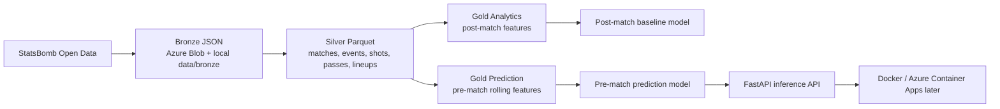

# World Cup AI Platform

Azure Data and AI platform for football match intelligence. The project ingests StatsBomb Open Data, stores raw data in Azure Blob Storage, builds Bronze/Silver/Gold datasets, trains match-result models, and exposes the honest pre-match model through a FastAPI inference service.

## Architecture



## What Is Implemented

- Azure setup: Resource Group, Storage Account, and `bronze`, `silver`, `gold` containers.
- Bronze ingestion: raw StatsBomb JSON downloaded locally and uploaded to Azure Blob Storage.
- Silver layer: normalized Parquet tables for matches, events, shots, passes, and lineups.
- Gold post-match layer: match analytics features useful for explainability and baseline modeling.
- Gold pre-match layer: rolling historical features with `shift(1)` to avoid current-match leakage.
- ML: Random Forest baselines for post-match and pre-match match-result classification.
- API: FastAPI service with `/health`, `/model/info`, and `/predict`.
- Orchestration: one Python command can run ingestion, transformations, and model training.
- Tests: unit coverage for ingestion, transformations, ML helpers, orchestration, and API behavior.

## Data Layers

Bronze stores source-like JSON:

```text
data/bronze/statsbomb/...
```

Silver stores clean Parquet tables:

```text
data/silver/statsbomb/matches/...
data/silver/statsbomb/events/...
data/silver/statsbomb/shots/...
data/silver/statsbomb/passes/...
data/silver/statsbomb/lineups/...
```

Gold stores model-ready features:

```text
data/gold/statsbomb/match_features/...
data/gold/statsbomb/prematch_match_features/...
```

## Run The Full Pipeline

```powershell
python -m orchestration.run_all_statsbomb_pipeline --ingestion-date 2026-05-14 --workers 2
```

If the network is unstable:

```powershell
python -m orchestration.run_all_statsbomb_pipeline --ingestion-date 2026-05-14 --workers 1
```

Run only model training after Gold datasets already exist:

```powershell
python -m orchestration.run_all_statsbomb_pipeline --skip-bronze --skip-silver --skip-gold --skip-prematch-gold
```

## Model Metrics

Current local pre-match baseline:

```text
Rows: 48
Raw rows: 65
Accuracy: 0.500
Dummy baseline: 0.417
```

Current local post-match baseline after adding more competitions:

```text
Rows: 306
Accuracy: 0.610
Dummy baseline: 0.442
```

The post-match model uses match statistics from the match itself, so it is useful for analytics but not for future prediction. The pre-match model uses rolling historical features known before kickoff, so it is the correct inference model even if the score is lower.

## API

Start locally:

```powershell
uvicorn api.main:app --reload
```

Health check:

```powershell
curl http://127.0.0.1:8000/health
```

Model metadata:

```powershell
curl http://127.0.0.1:8000/model/info
```

Prediction endpoint:

```text
POST /predict
```

Payload shape:

```json
{
  "home_team_name": "France",
  "away_team_name": "Argentina",
  "features": {
    "home_prematch_avg_goals_for_last_5": 1.8,
    "home_prematch_avg_goals_against_last_5": 0.8,
    "home_prematch_avg_goal_difference_last_5": 1.0,
    "home_prematch_avg_xg_last_5": 1.6,
    "home_prematch_avg_shots_last_5": 12.0,
    "home_prematch_avg_passes_last_5": 520.0,
    "home_prematch_avg_completed_passes_last_5": 450.0,
    "home_prematch_avg_pass_completion_rate_last_5": 0.86,
    "home_prematch_avg_points_last_5": 2.1,
    "home_prematch_win_rate_last_5": 0.6,
    "home_prematch_unbeaten_rate_last_5": 0.8,
    "home_prematch_matches_played_before": 5,
    "away_prematch_avg_goals_for_last_5": 1.5,
    "away_prematch_avg_goals_against_last_5": 1.0,
    "away_prematch_avg_goal_difference_last_5": 0.5,
    "away_prematch_avg_xg_last_5": 1.4,
    "away_prematch_avg_shots_last_5": 10.0,
    "away_prematch_avg_passes_last_5": 480.0,
    "away_prematch_avg_completed_passes_last_5": 405.0,
    "away_prematch_avg_pass_completion_rate_last_5": 0.84,
    "away_prematch_avg_points_last_5": 1.7,
    "away_prematch_win_rate_last_5": 0.4,
    "away_prematch_unbeaten_rate_last_5": 0.7,
    "away_prematch_matches_played_before": 5
  }
}
```

The API returns the predicted class plus `win`, `draw`, and `loss` probabilities using the trained pre-match model artifact:

```text
models/prematch_result_baseline.joblib
```

Demo-friendly prediction endpoint:

```text
POST /predict/from-teams
```

Payload:

```json
{
  "competition": "world_cup",
  "season": "2022",
  "home_team_name": "France",
  "away_team_name": "Argentina"
}
```

This endpoint reads the latest available pre-match team-form rows from:

```text
data/gold/statsbomb/prematch_team_form/competition=<competition>/season=<season>/prematch_team_form.parquet
```

It automatically builds the 24 model features, runs the trained pre-match model, and returns the prediction plus the source match rows used for each team.

## Docker

Build and run with local model artifacts mounted into the container:

```powershell
docker compose up --build
```

The service is available at:

```text
http://127.0.0.1:8000
```

`models/` and `reports/` are intentionally ignored by Git. Train the model locally or in CI/CD, then mount or publish the artifact for deployment.

## Tests

```powershell
python -m pytest
```

Run the full local quality gate:

```powershell
ruff check .
black --check api ingestion ml orchestration transformation tests
mypy api ingestion ml orchestration transformation tests
pytest
```

Install and run pre-commit hooks:

```powershell
pip install -r requirements-dev.txt
pre-commit install
pre-commit run --all-files
```

Last known result:

```text
31 passed
```

## Azure Resources

```text
Resource Group: rg-worldcup-ai-dev
Storage Account: stworldcupaifayssaldev
Containers: bronze, silver, gold
```

Authentication uses `DefaultAzureCredential`, with `Storage Blob Data Contributor` assigned to the Azure user.

## Roadmap

- Train on all available StatsBomb competitions.
- Add stronger pre-match features: Elo-style team strength, competition indicators, home/away deltas, and broader historical form.
- Compare Logistic Regression, Random Forest, and gradient boosting baselines.
- Add request examples and screenshots for API docs.
- Deploy the API to Azure Container Apps.
- Add Terraform for Azure infrastructure.
- Add model registry and monitoring later.
